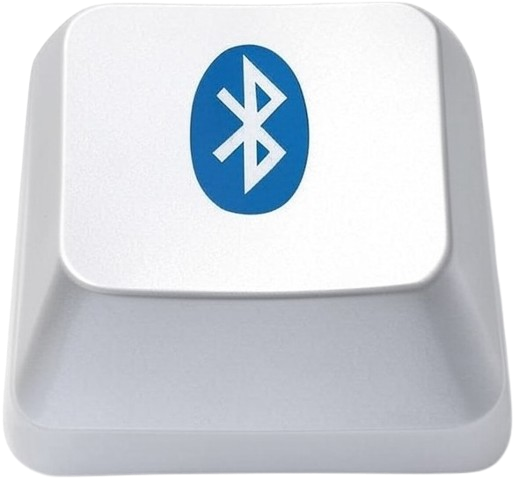

  

# magickeyboard-switcher-alfred-workflow
Alfred Workflow to easility switch the bluetooth connectivity of a single Magic Keyboard between several computers

## How to setup

1. Install [blueutil](https://github.com/toy/blueutil). You can use [brew](https://brew.sh/) - `brew install blueutil`
2. Ensure Alfred has Bluetooth permissions by going to Settings > Privacy and security > Bluetooth. You need to restart Alfred.
3. Find out your Magic Keyboard bluetooth MAC address. With the keyboard connected, keep the Option key pressed while you click on your status bar bluetooth icon.

  

## How to run the workflow

- **Option 1** - Keyboard shortcut: Option + Command + k
- **Option 2** - Alfred keyboard: `ks`

## How to switch keyboards

It's desirable to have Alfred and this workflow installed in both computers. 

First, run the workflow in the one that has the keyboard currently connected. It will disconnect it and make it discoverable.
Second, run the workflow in the other computer. It should connect it.

## Donate

If you enjoy my work, consider making a donation to support it!

  

 